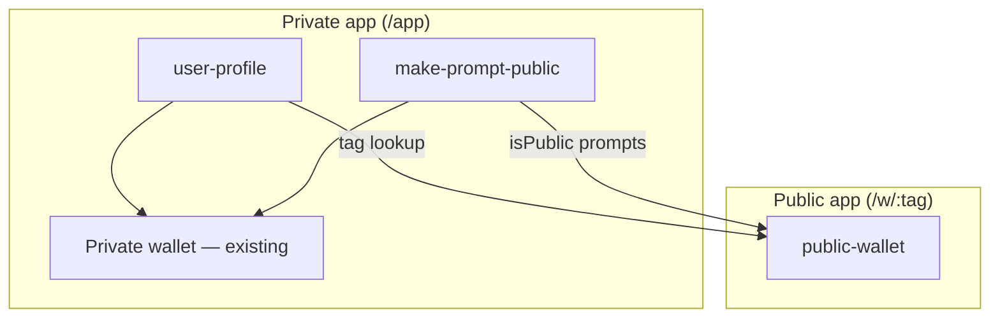

# AI Cues — Public Sharing Architecture

Source of truth for how the **user profile**, **make prompt public**, and **public wallet** features fit together.

## Goal

Let signed-in users claim a public **tag**, publish selected prompts, and share a read-only **public wallet** at `aicues.web.app/w/<tag>`. Visitors (including signed-out users) can browse and launch prompts with their chosen AI provider.

## Current State

| Area | Today |
|------|--------|
| App entry | `/app` → `app.html` → VanJS SPA |
| Auth | Firebase Auth (Google, email, anonymous guest) |
| Private prompts | `cueUsers/{uid}/prompts/{promptId}` — owner read/write only |
| Prompt fields | `title`, `body`, `createdAt`, `updatedAt` |
| Wallet UI | `PromptBoard` — create, edit, delete, launch |
| Profile | Session label (email) in toolbar only; no tag, no profile page |
| Routing | No client router; single authenticated library view |

## Module Map



| Module | Responsibility |
|--------|----------------|
| **user-profile** | Profile page at `/app/profile`; set tag; show email from Auth (not stored) |
| **make-prompt-public** | Share flow, public/private toggle, tag gate before first publish |
| **public-wallet** | Read-only wallet at `/w/:tag` and `/w/:tag/:promptId`; author tag heading; launch-only actions |

Modules communicate through **shared data** (Firestore documents) and **small shared interfaces** (profile store, public prompt query). No cross-imports of UI between modules.

## Data Model

### Profile — `cueUsers/{uid}`

| Field | Type | Notes |
|-------|------|-------|
| `tag` | string | URL slug; unique across all users |
| `updatedAt` | number | millis |

Email is **not** stored in Firestore. The profile page reads it from Firebase Auth at display time; if Auth has no email, nothing is shown.

Document may not exist until the user sets a tag.

### Tag index — `userTags/{tag}`

| Field | Type | Notes |
|-------|------|-------|
| `uid` | string | Owner uid; doc ID equals normalized tag |

Enforces uniqueness via create-only rules (no updates). Profile and index are written together in a transaction when the tag is set or changed (old index doc deleted when the tag changes).

**Tag rules (proposed):**

- 3–32 characters
- lowercase letters, digits, hyphens
- must start and end with alphanumeric
- normalized to lowercase on save

### Prompts — `cueUsers/{uid}/prompts/{promptId}` (extended)

| Field | Type | Notes |
|-------|------|-------|
| `isPublic` | boolean | default `false`; omitted treated as false in app code |
| *(existing)* | | `title`, `body`, `createdAt`, `updatedAt` |

Public listing: query `cueUsers/{uid}/prompts` where `isPublic == true`.

## Security (Firestore Rules)

| Path | Read | Write |
|------|------|-------|
| `cueUsers/{uid}` | Owner; **public read when `tag` is present** (for public wallet header) | Owner only; validate tag format |
| `userTags/{tag}` | **Public get** (tag → uid for public wallet); no list | Create if owner uid matches and doc absent; delete by owner only (tag change); no update |
| `cueUsers/{uid}/prompts/{promptId}` | Owner; **anyone if `resource.data.isPublic == true`** | Owner only; validate `isPublic` boolean when present |

Anonymous users cannot set tags or publish (account-only, matching existing prompt ownership rules).

## Routing

| URL | Audience | View |
|-----|----------|------|
| `/app` | Signed-in (or guest) | Private wallet (unchanged default) |
| `/app/profile` | Signed-in account | Profile page — edit tag, show email |
| `/w/:tag` | Anyone | Public wallet — all public prompts for tag |
| `/w/:tag/:promptId` | Anyone | Same, with one prompt highlighted |

**Hosting:** add rewrites for `/w/**` → `app.html` (same SPA shell as `/app`).

**Client router:** lightweight path parser in `main.js` (or a small `src/router.js`) chooses:

- `AuthenticatedApp` + optional profile sub-view for `/app` paths
- `PublicWalletApp` for `/w` paths

No new npm router dependency unless we outgrow this.

## UI Behavior

### user-profile

- Move profile out of the wallet toolbar into `/app/profile`.
- Fields: **tag** (editable; changing tag shows a warning that old `/w/<tag>` links will break). **Email** is read from Auth at render time only (never persisted); if Auth has no email, the profile page omits it.
- Link from private wallet toolbar (“Profile” or similar).
- Tag change uses a transaction: delete old `userTags/{oldTag}`, create `userTags/{newTag}`, update profile.

### make-prompt-public

- **Share** action on each private prompt row (account users only).
- Flow: Share → if no tag, inline tag picker (reuse profile validation) → confirm dialog → set `isPublic: true` → copy the prompt’s public URL (`/w/<tag>/<promptId>`).
- Public prompts show a **copy-link** action (copies that absolute URL) and a **green globe/network icon**; hover on the globe reveals “Make private”; click opens confirm dialog, then sets `isPublic: false`.
- Guest/anonymous: hide share control.

### public-wallet

- Layout mirrors private wallet (same list, provider picker, launch menu).
- **Read-only:** no New, Edit, Delete, Share.
- **Header:** author `@tag` as prominent heading only — **no email** on public pages.
- **Chrome:** **AI Cues** links to `/` (about/landing). Signed-in account users get **Your profile** → `/app/profile`; everyone else gets **Create account** → `/app` (auth gate). Same chrome on the unknown-tag page.
- **Highlighted prompt** (`/:promptId`): reorder list to put target first (or scroll into view), apply subtle glow class on that row.
- Unknown tag → friendly 404.
- Unknown or non-public prompt id → show an alert (“Prompt not found”) and still render the rest of the public wallet.
- **SEO:** public routes (`/w/*`) are indexable — no `noindex` on those pages; set a descriptive `<title>` (e.g. `@tag — AI Cues`).

## Shared Interfaces (between modules)

These are the contracts module builders implement against:

```js
// Profile
createProfileStore(db, uid) → {
  get: () => Promise<Profile | null>,
  setTag: (tag: string) => Promise<Profile>,
  isTagAvailable: (tag: string) => Promise<boolean>,
}

// Public prompts (read-only)
createPublicPromptStore(db) → {
  listByTag: (tag: string) => Promise<{ profile: Profile, prompts: Prompt[] } | null>,
  getPublic: (tag: string, promptId: string) => Promise<Prompt | null>,
}

// Private prompt store (extend existing)
update(id, { isPublic?: boolean })  // make-prompt-public uses existing store
```

## Implementation Order

1. **user-profile** — data model, rules, profile page, tag validation
2. **make-prompt-public** — `isPublic` field, share UI, rules update
3. **public-wallet** — routing, read-only board, highlight behavior

Profile and tag index must exist before publish flow; public wallet depends on both.

## Non-Goals (this phase)

- Custom display names, avatars, or bios
- Prompt versioning or fork-on-copy
- Analytics on public views
- Social features (follow, like, comments)
- Making the entire wallet public by default
- Server-side rendering or OG meta tags for shared links

## Decisions

| Topic | Decision |
|-------|----------|
| **Tag mutability** | Yes — users may change their tag; UI warns that old `/w/<tag>` links will break |
| **Email visibility** | Email from Auth only on `/app/profile` (never stored in Firestore); never on public wallet |
| **Unpublish** | Confirm before making a prompt private |
| **Bad prompt URL** | Alert “Prompt not found” + show the rest of the public wallet |
| **SEO** | Public wallet pages (`/w/*`) are indexable; set page title/description per tag |

## File Layout (planned)

```
src/
  profile/
    record.js          # tag validation, Profile type helpers
    firestore-store.js # get/setTag/isTagAvailable
    profile-page.js    # /app/profile UI
  prompts/
    record.js          # + isPublic field helpers
    firestore-store.js # + isPublic in patch/update
  sharing/
    share-prompt.js    # share flow + toggle UI pieces
    public-store.js    # listByTag, tag → uid resolution
  ui/
    public-wallet.js   # read-only PromptBoard variant
    router.js          # path → app shell
  main.js              # route bootstrap
docs/
  architecture.md      # this file
  modules/             # your module specs
.cursor/
  plans/               # per-module TDD plans (after sign-off)
```
